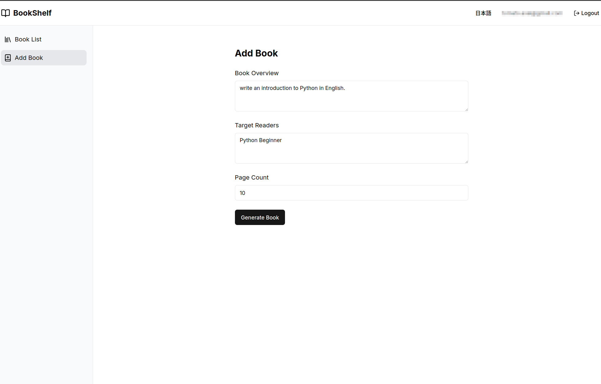
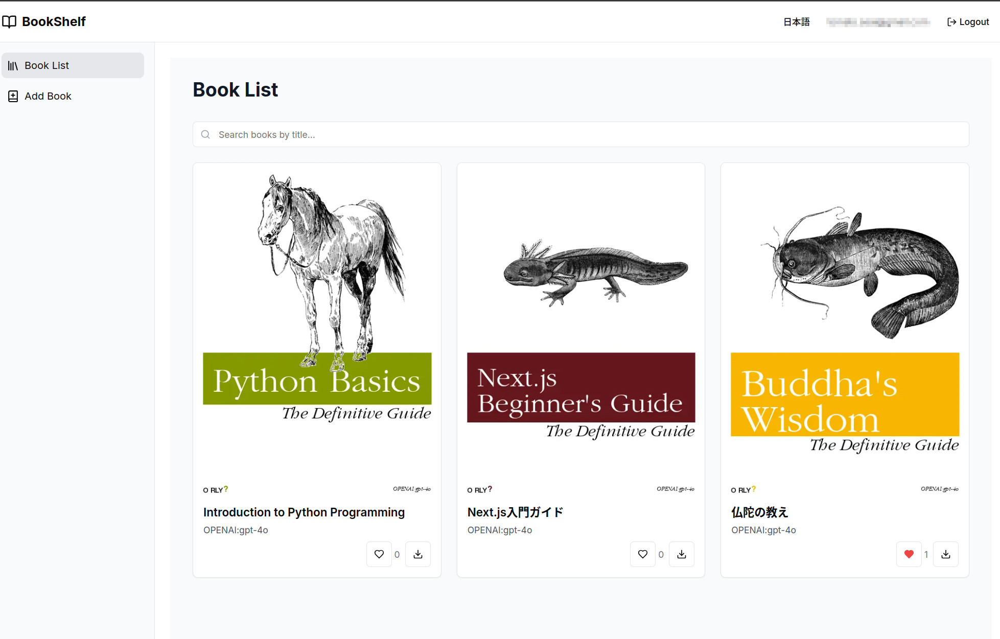

# CreativeBookShelf

AI-powered Book Generation and Management System

## Overview

CreativeBookShelf is a web application that automatically generates and manages books using AI.
It functions as a frontend for AutoGenBook (https://github.com/Tomatio13/AutoGenBook).
Please make sure to set up and run the AutoGenBook Docker container separately.

Users can generate books automatically by simply inputting a book overview and target audience.
Generated books are saved as PDFs and can be managed and viewed online.

## Key Features

- AI-powered book generation
- Book listing and search
- Like functionality
- PDF download
- User authentication

## Technology Stack

- Frontend
  - Next.js 14
  - TypeScript
  - Tailwind CSS
  - shadcn/ui

- Backend
  - Supabase (Authentication & Database)
  - FastAPI (AI Generation Server)

## Setup

### Prerequisites

- Node.js (v18 or higher)
- npm (v9 or higher)
- Supabase account

### 0. AutoGenBook Setup
Please refer to https://github.com/Tomatio13/AutoGenBook
to set up AutoGenBook.

### 1. Clone Repository
```bash
git clone <repository-url>
```

### 2. Build
```bash
docker compose build
```

### 3. Start Containers
```bash
docker compose up -d
```

The application will be available at http://localhost:3000

## Usage

1. Create Account
   - Select "Sign Up" from the top page
   - Register with email and password

2. Generate Book
   - Enter book overview and target audience on the "Add Book" page
   - Set page count and click "Generate Book"
   - Once generation is complete, the book will be automatically added to the list
    

3. Manage Books
   - View generated books on the top page
   - Like and download PDFs for each book
   - Search books by title using the search bar
    

**Note**
The default language for book generation is Japanese. If you want to generate the book in English, please specify in the description that you want to generate the book in English.

## License

MIT

## Contributing

Pull requests and issue reports are welcome.
For major changes, please open an issue first to discuss what you would like to change.

