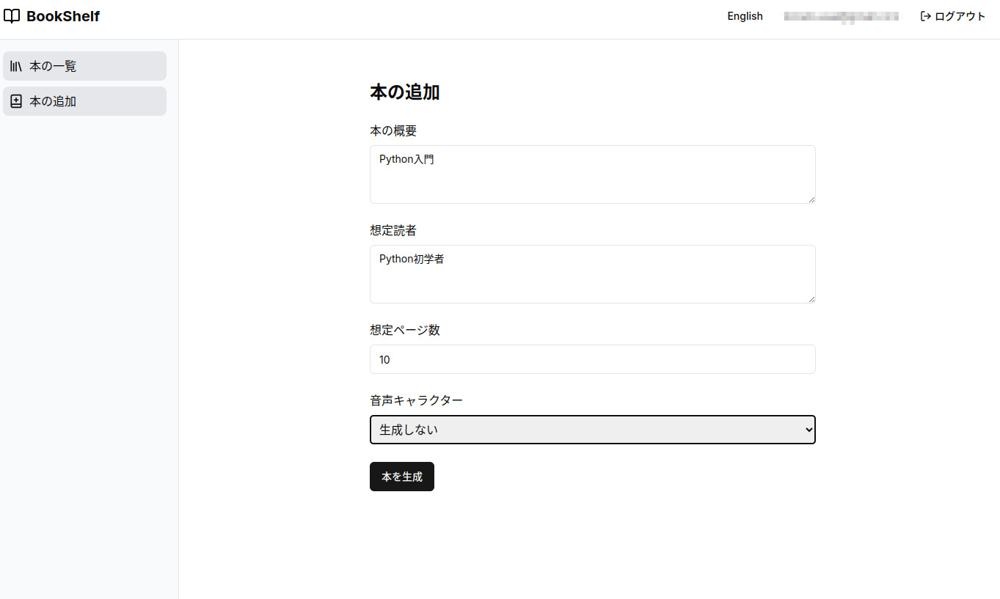
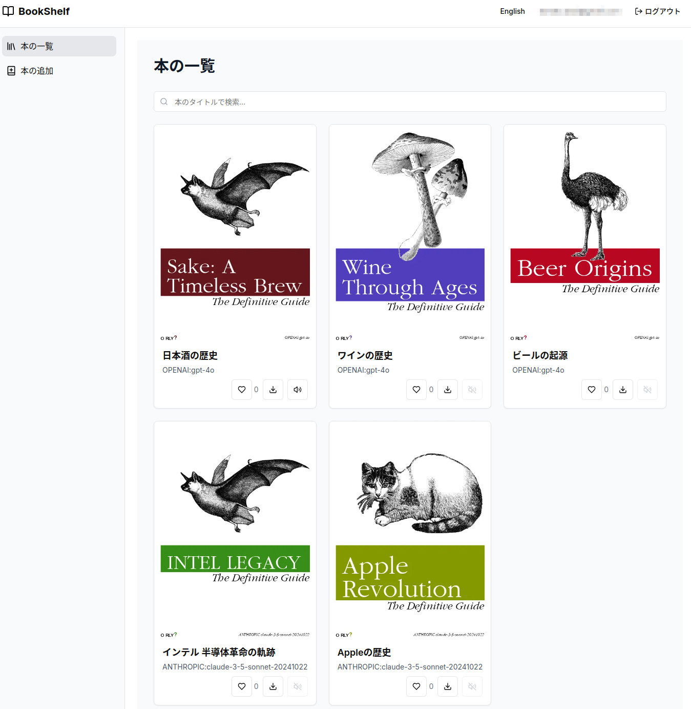

# CreativeBookShelf

AIを活用した本の自動生成・管理システム

## 概要

CreativeBookShelfは、AIを使用して本を自動生成し、管理できるWebアプリケーションです。
AutoGenBook(https://github.com/Tomatio13/AutoGenBook)のフロントエンドとして機能します。
AutoGenBookのDockerコンテナも別にセットアップ/起動しておいて下さい。

ユーザーは本の概要や想定読者を入力するだけで、AIが自動的に本を生成します。
生成された本はPDFとして保存され、オンラインで管理・閲覧することができます。

## 主な機能

- AIによる本の自動生成
- 本の一覧表示と検索
- いいね機能
- PDFダウンロード
- ユーザー認証

## 技術スタック

- フロントエンド
  - Next.js 15
  - TypeScript
  - Tailwind CSS
  - shadcn/ui

- バックエンド
  - Pockatebase (認証・データベース・ストレージ)
  - FastAPI (AI生成サーバー)

## セットアップ

### 前提条件

- Node.js (v18以上)
- npm (v9以上)

### 0. AutoGenBookのセットアップ
https://github.com/Tomatio13/AutoGenBook
上記のURLを参照し、AutoGenBookをセットアップして下さい。

### 1. リポジトリのクローン
```bash
git clone https://github.com/Tomatio13/CreativeBookShelf.git
```

### 2. ビルド
```bash
docker compose build
```

### 3. コンテナの起動
```bash
docker compose up -d
```

アプリケーションは http://localhost:3000 で起動します。

## 使用方法

1. アカウントの作成
   - トップページから「サインアップ」を選択
   - メールアドレスとパスワードで登録

2. 本の生成
   - 「本の追加」ページで本の概要と想定読者を入力
   - ページ数を設定して「本を生成」をクリック
   - 生成が完了すると自動的に一覧に追加
    
   - 生成された本の内容をWavファイルとして追加

3. 本の管理
   - トップページで生成された本の一覧を確認
   - 各本に対していいねやPDFダウンロードが可能
   - 検索バーで本のタイトルによる検索が可能
    
  - 各本に対してWavファイルのダウンロードが可能


### wavファイルについて
WAVファイルは、VOICEVOXの音声キャラクターを使用して本の内容を読み上げ、WAVファイルです。

出力には[Voicevox Core Engine](https://github.com/VOICEVOX/voicevox_engine)を使用します。
日本語のみ対応しているため、英語表示では出力できません。

以下の方法で、Voicevox Core Engineを起動してください。

Voicevoxのキャラクターは[キャラクター一覧](https://voicevox.hiroshiba.jp/)をご覧ください。

#### 音声キャラクターのクレジット
以下、クレジットです。
音声ファイルはクレジットを記載すれば、商用・非商用で利用可能とされています。
[キャラクター一覧](https://voicevox.hiroshiba.jp/)の利用規約をよく読んでください。

VOICEVOX：ずんだもん,四国めたん、春日部つむぎ、雨晴はう、波音リツ、玄野武宏、白上虎太郎、青山龍星、冥鳴ひまり、九州そら、
         もち子さん、剣崎雌雄、WhiteCUL、後鬼、No.7、ちび式じい、櫻歌ミコ、小夜/SAYO、ナースロボ_タイプT、✝聖騎士 紅櫻✝、
         雀松朱司、麒ヶ島宗麟、春歌ナナ、猫使アル、猫使ビィ、中国うさぎ、栗田まろん、あいえるたん、満別花丸、琴詠ニア、Voidoll(CV:丹下桜)


## ライセンス

MIT

## 貢献について

プルリクエストや課題の報告を歓迎します。
大きな変更を加える場合は、まず課題を開いて変更内容を議論してください。

